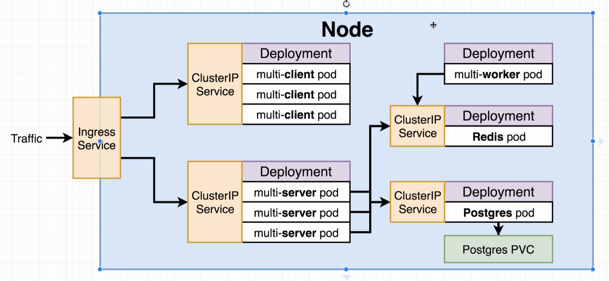

# Multiple Pods Kubernetes Cluster

Deploying Kubernetes cluster containing multiple pods with the following service to the Google Cloud Platform (GCP):

  - Nginx Ingress
  - Redis
  - Postgres
  - Postgres PVC
  - React
  - Express
  - Worker
  - ClusterIP service

The cluster architecture is given as
  
